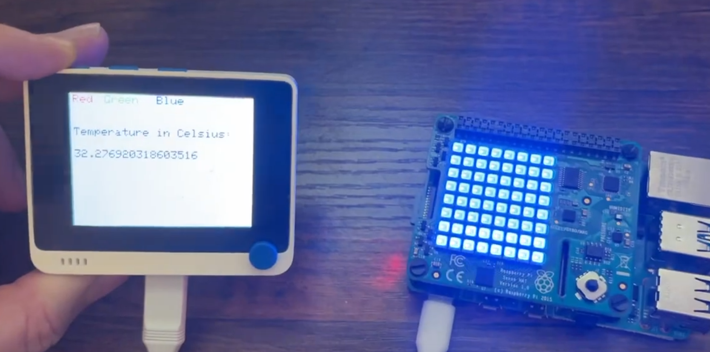
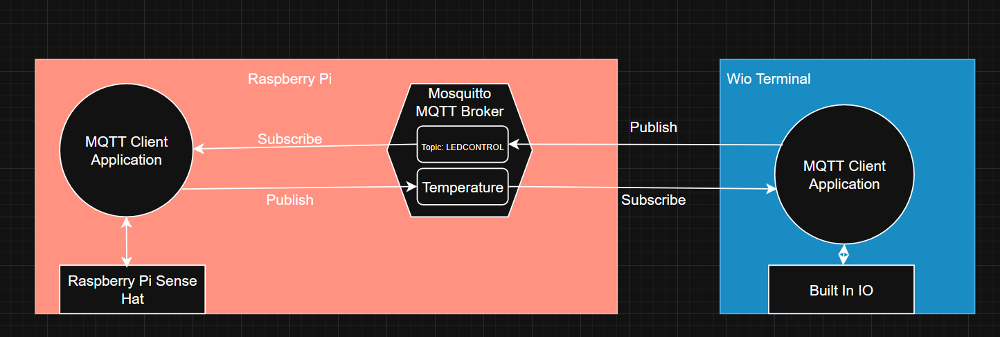

# IoT_PubSub_MQTT_System
Demo for IoT System using MQTT, a RaspberryPi, SenseHat, and Wio Terminal

[Video Demo Youtube](https://www.youtube.com/watch?v=bJO3hYRXezg)

## Overview

This simple IoT system demonstrates communication between a Linux computer (Raspberry Pi 4 with a Pi Sense HAT) and a Wi-Fi capable microcontroller (Wio Terminal) using MQTT (Message Queuing Telemetry Transport). The Raspberry Pi hosts the MQTT broker but is also able to act as a client and subscribe to and publish messages to the local broker. The broker is also opened up to traffic on a local Wi-Fi network when configured correctly. The microcontroller is able to subscribe and publish to the MQTT broker running on the Raspberry Pi. I made a simple system where pushing buttons on the Wio Terminal wirelessly changes the colors of the LEDs on the Raspberry Pi Sense HAT. The Wio Terminal is also set up to wirelessly display the real-time temperature from the temperature sensor on the Raspberry Pi Sense HAT.

## How it works

Initially, I tested this out by installing the MQTT broker "Mosquitto" on my Windows computer and used the included command line tools to test out my broker. There are free MQTT brokers available online that you can play around with, but I wanted my system to be completely local. I ended up moving my Mosquitto broker over to the Raspberry Pi 4 and configuring it from there. Once I was able to see my Mosquitto broker on my local network, I wrote a Python script for the Raspberry Pi to subscribe to the topic "LEDCONTROL" and wrote some logic to handle messages it received on this topic. If a message with a basic color was published to the topic "LEDCONTROL," such as "RED," then the Sense HAT on the Pi would turn all of its LEDs to the color red.

The Sense HAT also has a temperature sensor onboard, so I set up the Raspberry Pi to publish the temperature as a string in Celsius to a topic named "Temperature" every one second. I was also able to test that the temperature was being published from my PC command line tools that came with Mosquitto by subscribing to the "Temperature" topic using some of the included command line tools on Windows.

Next, I got the Wio Terminal set up to connect to the same Wi-Fi network that my Raspberry Pi was connected to. I was able to find a library for an MQTT client on Seeed Studio's site. I configured the screen and the buttons on the Wio Terminal using Arduino as my IDE. The three buttons on the Wio Terminal, when pressed, would simply publish a message ("RED," "BLUE," or "GREEN") that corresponded with the string below the buttons displayed on the screen to the topic "LEDCONTROL," which would change the color of the Raspberry Pi Sense HAT LED matrix.

I wanted to make a full loop for communication between the Wio Terminal and Raspberry Pi, so I also set up the Wio Terminal to subscribe to the topic "Temperature." When a new message was published to the "Temperature" topic by the Raspberry Pi, the Wio Terminal would update its display of the temperature.

## Data Flow Diagram

## Required Materials (If interested in building yourself)
| Hardware | Approximate Cost | Link |
|----------- |----------- |----------- |
| Raspberry Pi 4B | $50 |[adafruit Rpi 4B 2GB RAM](https://www.adafruit.com/product/4292?gad_source=1&gad_campaignid=21079227318&gclid=Cj0KCQjw18bEBhCBARIsAKuAFEbeRcwJzNLuQOKLY_5bH9ntqXfxbam0CYMqMhhZ4GmVBNloqqDBxl4aAjmfEALw_wcB)|
| Wio Terminal | $31 |[seeed studio](https://www.seeedstudio.com/Wio-Terminal-p-4509.html?gad_source=1&gad_campaignid=12740071602&gclid=Cj0KCQjw18bEBhCBARIsAKuAFEZAVwyn35bKEoUN1s9P2Ovan674jLmHh8MQVJCpfKPdu9wJlQKZuNUaAs5-EALw_wcB) |
| Raspberry Pi Sense Hat | $33 | [adafruit](https://www.adafruit.com/product/2738?gad_source=1&gad_campaignid=21079227318&gclid=Cj0KCQjw18bEBhCBARIsAKuAFEadNV0Zy0KDlKdEAOHhefJAUNybZ5q48ULkpUE5dcemNVeVmnFRbxQaAqUlEALw_wcB)|

# Useful Links

[Wio Terminal Starter Guide](https://wiki.seeedstudio.com/Wio-Terminal-Getting-Started/)

[Mosquitto MQTT Broker](https://mosquitto.org/)

[Pi Sense Hat Documentation](https://sense-hat.readthedocs.io/en/latest/)
