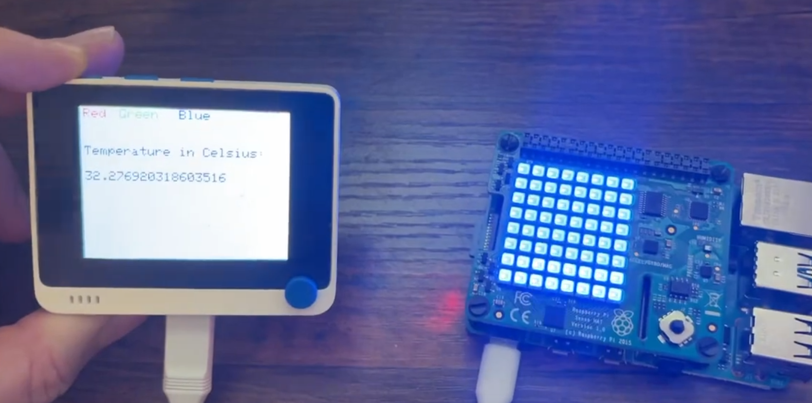

# IoT_PubSub_MQTT_System
Demo system for IoT System using MQTT, a RaspberryPi, SenseHat, and Wio Terminal

[Video Demo Youtube](https://www.youtube.com/watch?v=bJO3hYRXezg)

---
## Overview
This simple IoT system demonstrates communication between a linux computer(Raspberry Pi 4 with a Pi Sense Hat) and a Wifi Capable Microcontroller(Wio Terminal) using MQTT(Message Queuing Telemetry Transport). The Raspberry Pi hosts the MQTT Broker but is also able to act a client and subscribe and publish messages to the local broker.  The broker is also opened up to traffic on a local Wifi Network when configured correctly.  The microcontroller is able to subscribe and publish to the MQTT Broker running on the Raspberry Pi. I made a simple system where pushing buttons on the Wio Terminal wirelessly changes the colors of the LEDs on the Raspberry Pi Sense Hat. The Wio Terminal is also set up to wirelessly display the real time temperature of the temperature sensor on the Raspberry Pi Sense Hat.

---
## How it works

Initially I tested this out by installing the MQTT broker "Mosquitto" on my windows computer and used the included command line tools to test out my broker. There are free MQTT Brokers available online that you can do play around with but I wanted my system to be completley local. I ended up moving over my Mosquitto broker to the Raspberry Pi 4 and configuring it from there. Once I was able to see my Mosquitto Broker on my local internet I wrote a Python Script for the Raspberry Pi to subscribe to the topic "LEDCONTROL" and wrote some logic to handle messages it received on this topic. If a message with a basic color is published to the topic "LEDCONTROL" such as "RED" then the Sense Hat on the PI would turn all of it's LEDs to the color Red. 

The sense hat also has a temperature sensor onboard, so I set up the Raspberry Pi to Publish the temperature as a string in Celcius to a topic named "Temperature" every one second. I was able to also test that the temperature was being published from my PC command line tools that came with Mosquitto by subscribing to the "Temperature" topic using some of the included command line tools on Windows that came with the Mosquitto package.

Next, I got the Wio Terminal Set Up to connect to the same Wifi network that my Raspberry Pi was connected to. I was able to find a library for a MQTT Client on Seeed Studios site.  I configured the screen and the buttons on the Wio Terminal using Arduino as my IDE. The three buttons on the Wio Terminal when pressed would simply publish a message ("RED", "BLUE", or "GREEN") that corresponded with the string below the buttons displayed on the screen to the topic "LEDCONTROL" which would change the color of the Raspberry Pi Sense Hat LED matrix.

I wanted to make a full loop for communication between the Wio Terminal and Raspberry Pi, so I also set up the Wio Terminal to subscribe to the topic "Temperature". When a new message was published to the "Temperature" topic by the Raspberry Pi. The Wio Terminal would update it's display of the temperature. 

---
## Required Materials (If interested in building yourself)
| Hardware | Approximate Cost | Link |
|----------- |----------- |----------- |
| Raspberry Pi 4B | $50 |[adafruit Rpi 4B 2GB RAM](https://www.adafruit.com/product/4292?gad_source=1&gad_campaignid=21079227318&gclid=Cj0KCQjw18bEBhCBARIsAKuAFEbeRcwJzNLuQOKLY_5bH9ntqXfxbam0CYMqMhhZ4GmVBNloqqDBxl4aAjmfEALw_wcB)|
| Wio Terminal | $31 |[seeed studio](https://www.seeedstudio.com/Wio-Terminal-p-4509.html?gad_source=1&gad_campaignid=12740071602&gclid=Cj0KCQjw18bEBhCBARIsAKuAFEZAVwyn35bKEoUN1s9P2Ovan674jLmHh8MQVJCpfKPdu9wJlQKZuNUaAs5-EALw_wcB) |
| Raspberry Pi Sense Hat | $33 | [adafruit](https://www.adafruit.com/product/2738?gad_source=1&gad_campaignid=21079227318&gclid=Cj0KCQjw18bEBhCBARIsAKuAFEadNV0Zy0KDlKdEAOHhefJAUNybZ5q48ULkpUE5dcemNVeVmnFRbxQaAqUlEALw_wcB)|

---
# Useful Links

[Wio Terminal Starter Guide](https://wiki.seeedstudio.com/Wio-Terminal-Getting-Started/)

[Mosquitto MQTT Broker](https://mosquitto.org/)

[Pi Sense Hat Documentation](https://sense-hat.readthedocs.io/en/latest/)
